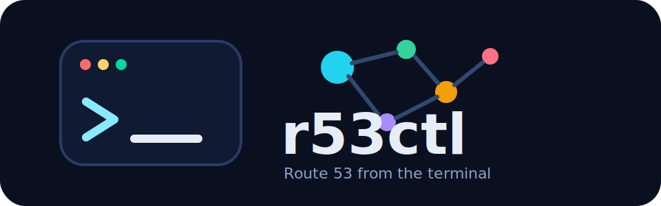

<p align="center">
  <a href="https://github.com/kespineira/r53ctl">
    
  </a>
</p>

<p align="center">
  <strong>A small, scriptable Amazon Route 53 CLI for hosted zones and DNS records.</strong>
</p>

<p align="center">
  <a href="https://github.com/kespineira/r53ctl/actions/workflows/ci.yml"></a>
  <a href="https://github.com/kespineira/r53ctl/releases"></a>
  <a href="https://pkg.go.dev/github.com/kespineira/r53ctl"></a>
  <a href="https://goreportcard.com/report/github.com/kespineira/r53ctl"></a>
  <a href="https://github.com/kespineira/r53ctl/blob/main/LICENSE"></a>
  <a href="https://github.com/kespineira/r53ctl/releases"></a>
</p>

`r53ctl` is intentionally small: list and manage hosted zones, upsert/delete basic record sets, and export records in JSON or BIND-style text.

## Contents

- [Why r53ctl?](#why-r53ctl)
- [Install](#install)
- [Authentication](#authentication)
- [Quick start](#quick-start)
- [Commands](#commands)
- [Supported records](#supported-records)
- [Release channels](#release-channels)
- [Roadmap](#roadmap)
- [Contributing](#contributing)
- [Security](#security)
- [License](#license)

## Why r53ctl?

- **Small surface area**: focused on Route 53 hosted zones and basic DNS records.
- **Automation-friendly**: JSON output, explicit destructive operations, and predictable exit codes.
- **Cross-platform**: Linux, macOS, and Windows builds for `amd64` and `arm64`.
- **Native AWS auth**: uses the standard AWS credential chain, profiles, and optional role assumption.
- **Release-ready**: GitHub Releases, checksums, Linux packages, and a Homebrew cask.

## Install

### Homebrew

```sh
brew install --cask kespineira/tap/r53ctl
```

### Install script

Linux and macOS:

```sh
curl -fsSL https://raw.githubusercontent.com/kespineira/r53ctl/main/scripts/install.sh | sh
```

Install a specific version:

```sh
curl -fsSL https://raw.githubusercontent.com/kespineira/r53ctl/main/scripts/install.sh | R53CTL_VERSION=v0.1.0 sh
```

### Go install

```sh
go install github.com/kespineira/r53ctl/cmd/r53ctl@latest
```

The project targets Go 1.26.3 or newer.

### Download artifacts

Every release publishes:

- `.tar.gz` archives for Linux and macOS
- `.zip` archives for Windows
- `.deb`, `.rpm`, and `.apk` Linux packages
- `checksums.txt`

See <https://github.com/kespineira/r53ctl/releases>.

## Authentication

`r53ctl` uses the AWS SDK credential chain:

- environment variables such as `AWS_ACCESS_KEY_ID`, `AWS_SECRET_ACCESS_KEY`, and `AWS_SESSION_TOKEN`
- shared config and credentials files
- AWS SSO profiles
- instance or task roles

Select a profile or assume a role:

```sh
r53ctl --profile prod zones list
r53ctl --profile tooling --role-arn arn:aws:iam::123456789012:role/dns-admin zones list
```

Use a custom endpoint for local testing:

```sh
r53ctl --endpoint-url http://localhost:4566 zones list
```

## Configuration

Persist default `profile`, `region`, and `output` so you don't repeat flags.
`r53ctl` stores them in `$XDG_CONFIG_HOME/r53ctl/config.json` (default
`~/.config/r53ctl/config.json`; Windows uses the OS config directory). Override
the location with `--config <path>`.

```sh
r53ctl config set profile Domains
r53ctl config set region eu-west-1
r53ctl config set output json
r53ctl config view
r53ctl config unset region
r53ctl config path
```

After setting a default profile, plain commands use it automatically:

```sh
r53ctl zones list                    # uses the saved profile
r53ctl --profile prod zones list     # the flag overrides the saved profile
```

Precedence, highest first:

1. Explicit command-line flag (`--profile`, `--region`, `--output`).
2. Environment variable (`AWS_PROFILE`, `AWS_REGION` / `AWS_DEFAULT_REGION`).
3. `config.json` value.
4. Built-in default (`output` → `table`, `region` → `us-east-1`, profile from the AWS credential chain).

If the config file is hand-edited into invalid JSON, `r53ctl` reports a parse error naming the path; fix or delete the file to recover.

## Quick start

List hosted zones:

```sh
r53ctl zones list
```

Create a zone:

```sh
r53ctl zones create example.com --comment "managed by r53ctl"
```

Upsert an `A` record:

```sh
r53ctl records upsert example.com \
  --name www.example.com \
  --type A \
  --ttl 300 \
  --value 192.0.2.10
```

Export records:

```sh
r53ctl records export example.com --format bind
r53ctl records export example.com --format json
```

Use JSON output for scripts:

```sh
r53ctl --output json records list example.com --type A
```

## Commands

```text
r53ctl zones list
r53ctl zones create <domain> [--comment <text>]
r53ctl zones delete <zone-id-or-name> --yes

r53ctl records list <zone-id-or-name> [--name <fqdn>] [--type <type>]
r53ctl records upsert <zone-id-or-name> --name <fqdn> --type <type> --ttl <seconds> --value <value>
r53ctl records delete <zone-id-or-name> --name <fqdn> --type <type> --yes
r53ctl records export <zone-id-or-name> --format bind|json

r53ctl config view
r53ctl config get <key>
r53ctl config set <key> <value>
r53ctl config unset <key>
r53ctl config path
```

Global flags:

```text
--profile <name>       AWS shared config profile
--region <region>      AWS region for SDK configuration
--role-arn <arn>       Role ARN to assume before calling Route 53
--endpoint-url <url>   Custom Route 53 endpoint URL
--output table|json    Output format
--config <path>        Path to r53ctl config file
```

## Supported records

Record upserts currently support:

| Type | Notes |
| --- | --- |
| `A` | IPv4 addresses |
| `AAAA` | IPv6 addresses |
| `CAA` | Certificate authority authorization records |
| `CNAME` | Canonical names |
| `MX` | Mail exchange values in `<priority> <exchange>` format |
| `NS` | Name server records |
| `SRV` | Service records in `<priority> <weight> <port> <target>` format |
| `TXT` | Values are quoted automatically when needed |

`records list` can filter any Route 53 record type returned by AWS, including records that `r53ctl` does not yet upsert.

## Release channels

Releases are built with GoReleaser and GitHub Actions.

```sh
git tag v0.1.0
git push origin v0.1.0
```

The release workflow builds multi-platform archives, Linux packages, checksums, release notes, and the Homebrew cask. See [docs/releasing.md](docs/releasing.md).

## Roadmap

- BIND zone file import
- Alias record upserts
- Private hosted zone creation
- Route 53 routing policies: weighted, failover, geolocation, and latency
- Safer diff and dry-run workflows for bulk changes

## Contributing

Issues and pull requests are welcome. Start with [CONTRIBUTING.md](CONTRIBUTING.md) for local setup, test commands, and release expectations.

## Security

Please do not report security issues in public issues. See [SECURITY.md](SECURITY.md).

## Built with

- [AWS SDK for Go v2](https://github.com/aws/aws-sdk-go-v2)
- [Cobra](https://github.com/spf13/cobra)
- [GoReleaser](https://goreleaser.com/)

## License

MIT License. See [LICENSE](LICENSE).
